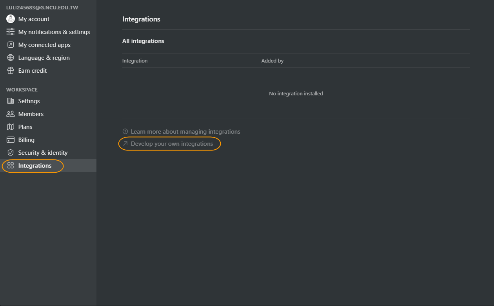
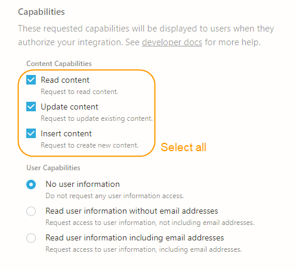
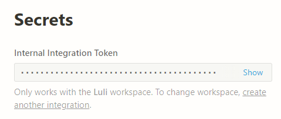
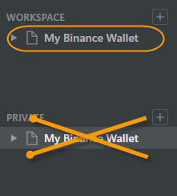
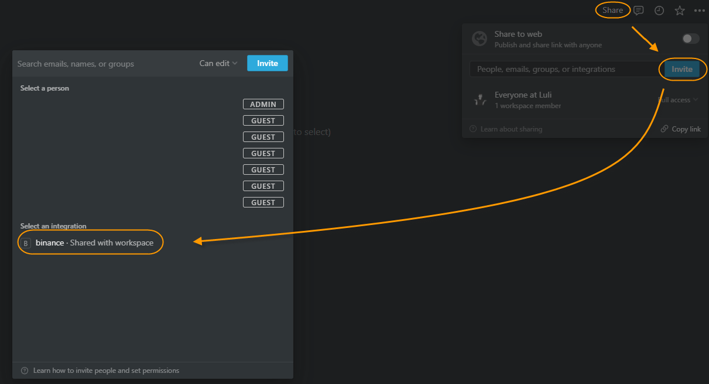
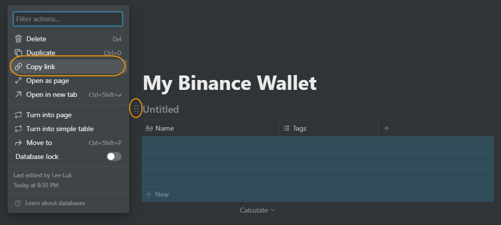

<div align="center">
	<h1> Show My Binance Wallet on Notion </h1>
	<p>
		<b>Show me the money!!!</b>
	</p>
	<br>
</div>

In order to inspect the detail of Crypto Investment by each symbol such as ***averaging buying price of*** `BTC/USDT`. I simply integrate **[Binance API](https://binance-docs.github.io/apidocs/spot/en/#introduction)** and **[Notion integrations](https://developers.notion.com/)** in this project.

# 📽️ Quick Demo

# 📃 Requirements

## Binance API Setup

- Create Binance API Key step by step by following the tutorial.
    
    [https://www.binance.com/en/support/faq/360002502072](https://www.binance.com/en/support/faq/360002502072)
    
- ✨ Copy the **API Key** (`API_KEY`)
- ✨ Copy the **Secret Key** (`SECRET_KEY`)

## Notion Integration Setup

1. Open the workspace setting by clicking on the `Settings and Members` option on the left navigation bar. And click on the button to go manage the notion integrations.

    

2. Create a new integration with authentication of Read, Update and Insert Content.

	

3. Once you save your changes, you will see the integration token. Keep it for further use.

    ✨Keep the **Internal Integration Token (**`NOTION_AUTH`**)**.


	

## Database Setup

1. (Important!!) Create a new page under your **WORKSPACE** instead of **PRIVATE** page.

	

1. Share the access to Integration we just created.

	

1. Type `/database` and choose `Table database - Inline` in anywhere. Then copy its link to get the `database_id` for further use.
    
    
    
    The format of copied link will like below: 
    
    `https://www.notion.so/{WORKSPACE}/{DATABASE_ID}?v={SOME_ID}`
    
    ✨ Keep the part of `{DATABASE_ID}` (`database_id`).
    

# 🚀 Usage

Steps to build a Docker image:

1. ***Clone this repo***
    
    ```bash
    git clone https://github.com/luli0034/binance-to-notion.git
    ```
    
2. ***Build the image***
    
    ```bash
    cd ./binance-to-notion
    docker build -t binance2notion . --no-cache
    ```
    
3. ***Set container parameters***
    
    Before running the built image, we need to set the environment variables for Binance API Key and secret as well as notion authentication.
    
    - `API_KEY` → Binance API key. 
    - `SECRET_KEY`→ Binance secret key.
    - `NOTION_AUTH` → Notion developer authentication key.

4. **Run the image's default command with the required parameters.**
    - `db_id` → Database ID ****which you want to update.
    - `base` → Coinbase (e.g. USDT, BUSD).
    
    ```docker
    docker run --env API_KEY={API_KEY}\
               --env SECRET_KEY={SECRET_KEY}\
               --env NOTION_AUTH={NOTION_AUTH}\
               binance2notion --db_id={database_id} --base={coinbase}
    ```
